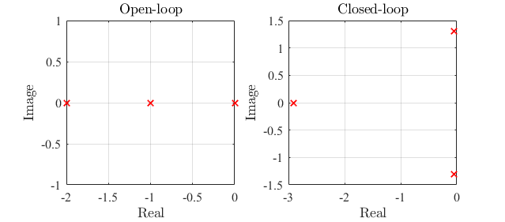
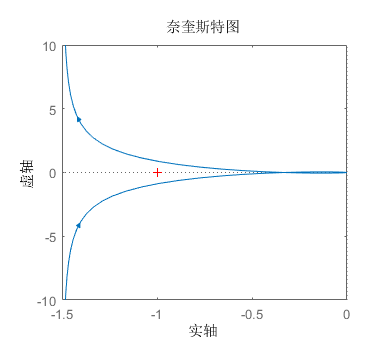
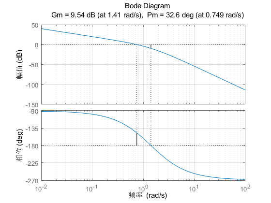

## 线性系统时域分析法

若已经得到系统的微分方程形式的数学模型，则可以应用时域分析方法。时域分析法物理概念清晰，准确性高，但是当系统阶数过高或模型不准确时应用该方法存在一定困难。

由于非线性系统中广泛采用时域分析方法，因此需要说明的是此处只考察模型确定的LTI系统。

### 时域性能指标

#### 动态性能指标

考察阶跃响应对应的指标：

- 上升时间$t_r$：阶跃响应$h(t)$从终值的10%上升到90%的时间。
- 峰值时间$t_p$：阶跃响应到达第一个峰值所需的时间（一般在动态响应有振荡的系统中有意义）
- 调节时间$t_s$：阶跃响应到达并保持在终值的$5\%$误差范围内所需的时间
- 超调量$\sigma\%$：表示最大偏离量的占比

$$
\begin{equation}
   \sigma \% = \left|\frac{y(t_p)-y(\infty)}{y(\infty)}\right| 
\end{equation}
$$

在电机调速控制系统中，还需要考察一些抗扰性能指标：

- 动态降落：突加扰动（负载）情况下，输出的最大下降占终值的百分比
- 动态恢复时间：突加扰动（负载）后，输出恢复并保持在终值的$5\%$误差范围内所需的时间

#### 稳态性能指标

稳定性：严格的稳定性定义由Lyapunov理论给出。通俗的稳定性含义是有限输入情况下，输出不会趋于无穷大。
稳态误差$e_{ss}$：表示无限长时间后，实际输出和期望输出的偏差，公式表示为

$$
\begin{equation}
   e_{ss} = \lim_{t\to \infty}{\left(r^*(t)-y(t)\right)}
\end{equation}
$$

### 典型系统分析

#### 一阶系统

输入到输出的传递函数表达式为：

$$
\begin{equation}
   \frac{Y(s)}{U(s)} = \frac{1}{Ts+1} = \frac{\omega}{s+\omega}
\end{equation}
$$

一阶系统在典型输入激励下的响应可以通过Laplace逆变换或求解线性微分方程得到。例如阶跃响应的求解过程：
 
$$
\begin{equation}
\begin{array}{c}
   \dot y + \omega y= \omega  \\
   \downarrow \\
   y = 1-\exp(-\omega t)
\end{array}
\end{equation}
$$

$$
\begin{equation}
\begin{array}{c}
   Y(s) = \frac{\omega}{s(s+\omega)} = \frac{1}{s} - \frac{1}{s+\omega}  \\
   \downarrow \\
   y = 1-\exp(-\omega t)
\end{array}
\end{equation}
$$

#### 二阶系统

二阶系统的传递函数的标准形式：

$$
\begin{equation}
   \frac{Y(s)}{U(s)} = \frac{\omega_n^2}{s^2+2\zeta\omega_n s+\omega_n^2}
\end{equation}
$$

其中$\zeta$称为阻尼比，$\omega_n$称为自然振荡频率

考察系统的阶跃响应，时域响应表达式可以分为三种情况：

**① 欠阻尼（$0<\zeta<1$）**：

特征值为一对共轭复根：

$$
\begin{equation}
   \lambda_{1,2} = -\zeta\omega_n \pm j\omega_n\sqrt{1-\zeta^2}
\end{equation}
$$

单位阶跃响应

$$
\begin{equation}
   y(t) = 1 - \frac{1}{\sqrt{1-\zeta^2}}e^{-\zeta\omega_nt}\sin(\omega_d t+\beta)
\end{equation}
$$

其中$\omega_d=\omega_n\sqrt{1-\zeta^2}$为阻尼振荡频率，$\beta = \arccos\zeta$为阻尼角。

根据输出的表达式，可以求出欠阻尼二阶系统阶跃响应的动态性能指标：

$$
\begin{equation}
   \begin{array}{c}
      t_r = \cfrac{\pi-\beta}{\omega_d} \\
      t_p = \cfrac{\pi}{\omega_d} \\ \\
      t_s = \left\{ \begin{array}{c} \cfrac{3.5}{\zeta\omega_n} \\ \\ \cfrac{4.4}{\zeta\omega_n} \end{array}\right. \\ \\
      \sigma\% = \exp\left({-\cfrac{\pi\zeta}{\sqrt{1-\zeta^2}}}\right)\times 100\%
   \end{array}
\end{equation}
$$

**② 临界阻尼（$\zeta=1$）**

特征根为一对实重根：

$$
\begin{equation}
   \lambda_{1,2} = -\omega_n
\end{equation}
$$

单位阶跃响应

$$
\begin{equation}
   y(t) = 1 - e^{-\omega_nt}(1+\omega_n t)
\end{equation}
$$

**③ 过阻尼（$\zeta>1$）**：

有2个负实特征根：

$$
\begin{equation}
   \lambda_1 = \frac{1}{T_1},\lambda_2 = \frac{1}{T_2}
\end{equation}
$$

单位阶跃响应

$$
\begin{equation}
   y(t) = 1+\frac{T_2e^{-t/T_2} - T_1e^{-t/T_1}}{T_1-T_2}
\end{equation}
$$

#### 高阶系统分析

闭环主导极点

偶极子

### 稳定性判据

#### Hurwitz判据

#### Routh判据

### 稳态误差

## 根轨迹分析

### 相关概念

根轨迹的手工画法无需深入研究，由一系列绘图法则组成，没什么实用价值。实际应用过程中用MATLAB代码`rlocus`即可画出系统的根轨迹。真正需要熟悉的，有实用价值的是根轨迹的相关概念、分析思想及其与系统性能的联系。

==根轨迹==：根轨迹表示系统开环根轨迹增益从0变化到无穷过程中，系统闭环特征根在复平面上形成的轨迹。

==参数根轨迹==是以下形式开环传递函数的增益$K^*$：

$$
\begin{equation}
   G(s) = K^*\cfrac{\prod_{i=1}^m {(s-z_i)}}{\prod_{j=1}^n {(s-p_j)}}
\end{equation}
$$

则系统的闭环特征方程表示为

$$
\begin{equation}
   1+G(s) = 1+K^*\cfrac{\prod_{i=1}^m {(s-z_i)}}{\prod_{j=1}^n {(s-p_j)}} = 0
\end{equation}
$$

分解为==幅值条件==和==相位条件==：

$$
\begin{equation}
   \begin{array}{c}
      K^* = \left|\cfrac{\prod_{j=1}^n {(s-p_j)}}{\prod_{i=1}^m {(s-z_i)}}\right| \\ \\
      \sum_{i=1}^m \angle{(s-z_i)} - \sum_{j=1}^n\angle{(s-p_j)} = -180^\circ
   \end{array}
\end{equation}
$$

==参数根轨迹==：广义上根轨迹可以表示LTI系统任意参数变化时闭环极点在复平面上的变化情况。因此根轨迹常用于求解某一参数的使系统稳定的取值范围，分析参数变化对稳定性的影响，这是根轨迹作为一种LTI系统分析方法的核心。绘制任意参数$K_g$的根轨迹时，需要将闭环特征方程变换为形如$1+K_gG^\prime(s)=0$的方程。

### 手动绘制根轨迹依据的法则

### 基于根轨迹的系统性能分析

根轨迹和系统性能的关系：

- 稳定性：左半平面根轨迹表示在对应的参数条件下，系统稳定；右半平面反之；当选取某一参数，根轨迹恰好移动到虚轴上，则对应参数是临界稳定参数。
- 动态性能：关于实轴共轭对称的根轨迹一般对应振荡的动态响应，越靠近实轴振荡频率越小，实轴上的根轨迹通常对应指数收敛的模态；根轨迹在左半平面越靠近虚轴对应的动态响应越快。
- 若根轨迹上有些分支到虚轴的距离相比其他分支要小得多，并且距离零点较远，则这些根轨迹为主导根轨迹，系统的性能主要由根轨迹的这些分支决定

## 线性系统频域分析

时域方法准确、直观，但有时无法采用解析法求解系统的时域响应。

频域分析法是一种图解分析法，可以用于分析系统的稳态和动态性能，且时域性能指标也能在频域找到对应的度量。

### 频率特性的基本概念

频率特性：线性系统在某一频率的输入激励下，稳态输出中的同频分量与输入分量的比$\cfrac{Y(j\omega)}{X(j\omega)}$和频率的关系。

频率特性的几何表示法：

1. 幅相特性曲线（Nyquist图）
2. 对数频率特性曲线（Bode图）
3. 对数幅相曲线（Nichols图）

#### Nyquist图

Nyquist图是$\omega$从0变化到无穷过程中，$G(j\omega)$在复平面上形成的轨线。

假设系统传递函数表达式

$$
\begin{equation}
   G(s) = \frac{b_ms^m+\cdots b_0}{a_ns^n+\cdots a_0}=\frac{K(s-z_1)\cdots(s-z_m)}{s^v(s-p_1)\cdots(s-p_{n-v})}
\end{equation}
$$

则$G(s)$的Nyquist图有以下特点：

1. $\omega\rightarrow 0 $时，若$v=0$，即没有原点处极点，则曲线从正实轴上$s=b_0/a_0$处开始，若$v\neq0$，则曲线从无穷远、相角为$-v\pi/2$处起始
2. $\omega\rightarrow \infty $时，若$n=m$，则曲线终止于正实轴上$s=b_m/a_n=K$处，若$n\neq m$，则曲线终止于原点且从$(m-n)\pi/2$角度趋于原点。
3. 若$G(s)$有纯虚极点，则Nyquist曲线有中断。

Nyquist图的手动画法是，通过数学变换得到表达式：

$$
\begin{equation}
   G(j\omega) = P(j\omega)+jQ(j\omega)
\end{equation}
$$

然后逐渐增大$\omega$在复平面上描绘出各个$\omega$对应的点，用曲线连接，同时注意起始点、终止点的位置和方向。也可以进一步变换得到$P, Q$的关系式：

$$
\begin{equation}
   h(P(\omega), Q(\omega))=0
\end{equation}
$$

这是平面曲线的解析表达式。

#### Bode图

Bode图由对数幅频特性和对数相频特性曲线构成。幅频特性的纵坐标为$20\lg A(\omega)$（线性坐标系，单位分贝（dB）），相频特性曲线纵坐标为$\varphi(\omega)$（线性坐标系，单位°），横坐标均为$\omega$（对数坐标系）

Bode图难以手动绘制，但是对于零极点形式的传递函数表达式，可以绘制其渐进频率特性曲线，渐进陪你了特性曲线中蕴含稳态和动态性能的直观信息，可以用于近似分析。

对于Bode图中相关的频率点的概念，在后续频域稳定性分析中再细化说明。

#### Nichols图

将Bode图中的幅频特性和相频特性合并在一张图中，横坐标为$L(\omega) = 20\lg A(\omega)$线性分度，纵坐标为$\varphi(\omega)$线性分度

### 频率域稳定判据

#### Nyquist稳定判据

首先给出Nyquist稳定判据的基础：幅角原理，然后分析为什么依据频域特性曲线和开环特征能够推导出不稳定闭环极点个数。

==幅角原理==：若复变函数$F(s)$在复平面某一区域$\Omega$内解析，则对于$s=\sigma+j\omega\in\Omega$，总有$F(s)=P+jQ$与之对应。此时，称$F(s)$平面中的点$P+jQ$是$s$平面中的点$\sigma+j\omega$的象。

下面分析Nyquist判据的推导过程。

为了得到系统的稳定性，研究关注的是右半平面的闭环极点，若不存在右半平面闭环极点则系统稳定，否则不稳定。

构造一个辅助函数$F(s)$，其零点对应原系统闭环极点。显然取$F(s)=1+G(s)H(s)$可以满足这一条件（$G(s)H(s)$为系统开环传递函数），同时此时$F(s)$的极点对应原系统开环极点。

利用幅角原理，若在$s$平面上构造一个顺时针包围整个右半平面且不经过$F(s)$奇异点的闭合曲线$\Gamma$，包围$F(s)$的$P$个极点和$Z$个零点，则曲线在$F(s)$平面内的映射曲线$\Gamma_F$围绕原点逆时针旋转$P-Z$周，则$G(s)H(s)$平面内的映射曲线$\Gamma_{GH}$围绕$(-1, 0)$逆时针旋转$R=P-Z$周。如果系统没有右半平面的闭环极点，即$F(s)$没有右半平面零点，即$Z=0$。因此，系统稳定的条件是$R=P$，即$G(s)H(s)$平面内的映射曲线$\Gamma_{GH}$围绕$(-1, 0)$逆时针旋转的周数等于右半平面的开环极点数。

以下要解决的是如何精确得到$G(s)H(s)$平面内的映射曲线围绕$(-1, 0)$逆时针旋转的圈数的问题。

包围整个$s$右半平面且不经过$F(s)$奇异点的闭合曲线$\Gamma$的选取：

- 若$F(s)$无虚轴上奇异点，则$\Gamma$由$s=j\omega,\omega\in (-\infty, \infty)$ 和 $s=\infty e^{j\theta}, \theta\in [-90\degree, 90\degree]$.
- 若$F(s)$有原点处奇异点，则在原点处做半包围曲线$s=\varepsilon e^{j\theta}, \theta\in[-90\degree, 90\degree]$
- 若$F(s)$有虚轴上奇异点$j\omega_n$，则在奇异点处做半包围曲线$s=j\omega+\varepsilon e^{j\theta}, \theta\in[-90\degree, 90\degree]$

由于$\Gamma$和映射曲线$\Gamma_{GH}$关于实轴对称，因此只需要考虑$\Gamma$上半部分对应的半包围映射曲线，另一半曲线只需要关于实轴对称变换即可得到。半包围映射曲线$\Gamma_{GH}$：

- 若$F(s)$无虚轴上奇异点，则$\Gamma_{GH}$对应$G(s)H(s)$的Nyquist曲线，即系统开环Nyquist曲线
- 若$F(s)$有原点处$l$重极点，则$\Gamma_{GH}$对应$G(s)H(s)$的Nyquist曲线，外加增补曲线：沿无穷大半径顺时针从0°到$-l90\degree$的曲线
- 若$F(s)$有虚轴上$l$重极点$j\omega_n$，则$\Gamma_{GH}$对应$G(s)H(s)$的Nyquist曲线，外加增补曲线：从$G(j\omega_n-)H(\omega_n-)$开始沿无穷大半径顺时针环绕$l180\degree$角度到$G(j\omega_n+)H(\omega_n+)$的曲线

考察半包围曲线$\Gamma_{GH}$经过实轴上$(-\infty, -1)$区段的次数和形态：

- 方向从上到下（逆时针）为正穿越次数：穿过记1，起始或终止记0.5，总次数记为$N_+$
- 方向从下到上（顺时针）为负穿越次数：穿过记1，起始或终止记0.5，总次数记为$N_-$

则完整的映射曲线逆时针包围$(-1, 0)$的圈数为$R=2N=2(N_+-N_-)$。由此得到Nyquist稳定判据。

==Nyquist稳定判据==：反馈控制系统闭环稳定的充分必要条件是：

- $\Gamma$的映射曲线$\Gamma_{GH}$不经过$(-1, 0)$（临界稳定）
- $\Gamma_{GH}$逆时针包围$(-1, 0)$的圈数$R$等于开环传递函数右半平面极点数$P$。根据前面给出的$R$计算方法，表示为$P=2N$.

#### 对数频域稳定判据

在Nyquist稳定判据中，通过考察半闭合曲线$\Gamma_{GH}$穿过$(-1, 0)$区域的的次数和形态来判断稳定性，对应对数频率特性曲线中，需要考察幅度$A(\omega)>1$时相角$\varphi(\omega)$穿过$(2k+1)\pi$的次数，找出和Nyquist稳定判据中对应的$N$。

做开环传递函数的Bode图，在$A(\omega)>1$范围从下向上穿过$(2k+1)\pi$的次数$N$的方法：

- 从下向上（角度增大方向）为正穿越次数：穿过记1，起始或终止记0.5，总次数记为$N_+$
- 从上向下（角度减小方向）为负穿越次数：穿过记1，起始或终止记0.5，总次数记为$N_-$

==对数稳定判据==：反馈控制系统闭环稳定的充分必要条件是：

- $A(\omega)=1$时，$\varphi(\omega)\neq (2k+1)\pi$（临界稳定）
- 开环传递函数的Bode图在$A(\omega)>1$范围从下向上穿过$(2k+1)\pi$的次数$N$和开环右半平面极点数$P$满足$P=2N$。

### 分析举例

用开环传递函数为如下形式的单位负反馈系统为例子来讲述上述理论的应用

$$
\begin{equation}
G(s) = \frac{5}{s(s^2+3s+2)}
\end{equation}
$$

绘制开环和闭环零极点分布图如下，可以看出系统无右半平面的开环极点和闭环极点，系统是稳定的，且无右半平面开环零点，因此是最小相位系统。

  

用MATLAB绘制Nyquist图如下。由于开环传递函数存在原点处单极点，因此需要补做从$\infty\angle180^\circ$到顺时针旋转180°到$\infty\angle -180^\circ$的虚线才构成完整的闭合曲线。所以闭合映射曲线$\Gamma_{GH}$逆时针包围$(-1, 0)$点的圈数是$R=0$。前面已经给出了开环极点分布，右半平面开环极点数是$P=0$，因此右半平面闭环极点数是$Z=P-R=0$。根据Nyquist判据：

- $\Gamma_{GH}$不经过$(-1, 0)$
- $P=R$

因此可以判定系统闭环稳定。

  

绘制开环Bode图如下，截止频率$\omega_c = 0.749 \text{rad/s}$，穿越频率$\omega_x = 1.41 \text{rad/s}$。在$L(\omega)>0$频段内，相频特性曲线穿越$(2k+1)180\degree$的次数为0，即$N=0$，因此$P=2N$，由对数稳定判据：

- 未出现$L(\omega_x)=0$且$\varphi(\omega_c)=0$
- $P=2N$

同样可以判定系统是闭环稳定的。

  

图中还标示了系统的稳定裕度：相位裕度$\gamma=32.6\degree$，幅值裕度$h=9.54\text{dB}$

## 线性系统校正方法

串联校正

串联超前校正

传递函数：

$aG_c(s)=\cfrac{1+aTs}{1+Ts}\ (a>1)$.

渐进频率特性曲线

在$\omega_m=\cfrac{1}{\sqrt{a}T}$处取得最大超前角$2\arctan\sqrt{a}-\cfrac{\pi}{2}$.

作用：在中频段，提高截止频率，提高相角裕度

步骤：

1. 根据稳态精度指标确定开环增益$K$；

2. 确定校正后系统的截止频率$\omega_c^{''}$；

3. 假设校正后在截止频率处取得最大超前相角，即$\omega_{c}^{''}=\omega_m$，根据截止频率处的幅值计算$a$：

   $L(\omega_c^{''})+20\lg\left(\left|\cfrac{1+j\sqrt{a}}{1+j\cfrac{1}{\sqrt{a}}}\right|\right)=0$，简化为：$10\lg{a}+L(\omega_c^{''})=0$.

4. 根据$\omega_m$和$a$计算$T$：$T=\cfrac{1}{\omega_m\sqrt{a}}$.

5. 验算

1. 根据稳态精度指标确定开环增益$K$；

2. 确定校正后的相角裕度$\gamma^{''}$；
3. 确定需要增加的相位超前角$\varphi_m$：$\varphi_m+\gamma-\varepsilon=\gamma^{''}$，其中$\varepsilon$是由于截止频率增大而造成的原系统相角裕度减小的补偿量
4. 根据最大相位超前角确定$a$：$a=\tan^2\left(\cfrac{\varphi_m+\pi/2}{2}\right)=\cfrac{1+\sin(\varphi_m)}{1-\sin(\varphi_m)}$.
5. 计算校正后系统的截止频率，使得校正网络在新的截止频率处取得最大相位超前角：$10\lg{a}+L(\omega_c^{''})=0，\omega_c^{''}=\omega_m$.
6. 根据$\omega_m$和$a$计算$T$：$T=\cfrac{1}{\omega_m\sqrt{a}}$.
7. 验算

串联滞后校正

校正网络：$G_c(s)=\cfrac{1+bTs}{1+Ts},\ (b<1)$.

1. 根据相角裕度的指标要求，确定校正后的截止频率：
   $\gamma^{''}=\gamma(\omega_c^{''})+\varphi_c(\omega_c)$，其中$\gamma(\omega_c^{''})$表示假设原系统截止频率为$\omega_c^{''}$时的相角裕度，$\varphi_c(\omega_c)$表示由于串联滞后校正网络的相角滞后作用带来的相角滞后的补偿量，一般取$-14\degree$到$-6\degree$.
2. 根据在新的截止频率处幅值为0确定$b$：$20\lg{b}+L(\omega_c^{''})=0$，认为截止频率大于校正网络的两个转折频率，在截止频率处处于校正网络的高频段
3. 确定校正网络的第二个转折频率$\omega_2$，通常为$\omega_{c}^{''}$的0.1~2倍，然后确定参数$T$：$T=\cfrac{1}{b\omega_2}$.
4. 验算幅值裕度和相角裕度

1. 中频段以-20dB/dec的斜率穿越零分贝线，而且这一斜率占有足够的频带宽度，则系统的稳定性好
2. 截止频率（或称剪切频率）越高，则系统的快速性越好。
3. 低频段的斜率陡、增益高，表示系统的稳态精度好（即静差率小、调速范围宽）
4. 高频段衰减得越快，即高频特性负分贝值越低，说明系统抗高频噪声干扰的能力越强

